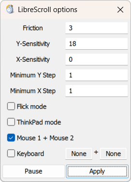

# LibreScroll

> **Note:** This is a customized fork of [EsportToys/LibreScroll](https://github.com/EsportToys/LibreScroll). This version introduces additional trigger mechanisms: simultaneous Mouse 1 + Mouse 2 chording and customizable Keyboard triggers.

Smooth inertial scrolling on Windows with any regular mouse.

### [Download Here](https://github.com/EsportToys/LibreScroll/releases)

https://github.com/EsportToys/LibreScroll/assets/98432183/c7fc05a5-6b10-4b91-9984-0d809a52b025


## Instructions
1. Run LibreScroll
2. Hold your trigger and move your mouse — the cursor will stay in-place, mouse motion is instead converted to scroll momentum:
   - **Mouse 3 (Middle Mouse Button)**: Hold Mouse 3 (middle-mouse-button) and move your mouse. Release middle-mouse-button to halt scroll momentum and release the cursor. (Single-clicking without dragging still sends a normal middle-click).
   - **Mouse 1 + Mouse 2** (Chording): Hold both Left (Mouse 1) and Right (Mouse 2) buttons together. Normal single-clicks on either button continue to work as usual.
   - **Keyboard Trigger** (Optional Hotkey): Hold a custom key or two-key combination (e.g. `Alt`, `Ctrl + Space`).
3. Release the trigger to halt scroll momentum and release the cursor.


To compile from source, run 
```
zig build
```

The release artifacts provided are compiled with the following flags:
```
zig build --release=small -Dtarget=x86_64-windows-gnu
```

## Options



### Friction
The rate at which momentum decays.

(Units: deceleration per velocity, in s&#8315;&sup1;)

### X/Y-Sensitivity
The horizontal/vertical multiplier at which mouse movement is converted to scroll momentum. 

Set a negative sensitivity to use reversed-direction scrolling, or zero to disable that axis entirely.

(Units: scroll-velocity per mouse-displacement, in s&#8315;&sup1;)

### Minimum X/Y Step
The granularity at which to send scrolling inputs.

This is a workaround for some legacy apps that do not handle smooth scrolling increments correctly. 

A "standard" coarse scrollwheel step is 120, and the smallest step is 1.

### Flick Mode
When enabled, releasing the trigger will not stop the scrolling momentum. 

Press any button again (or move the actual wheel) to stop the momentum.

### ThinkPad Mode
When enabled, scrolling snaps to either horizontal or vertical, never both at the same time.

This emulates how scrolling works on ThinkPad TrackPoints.

### Mouse 1 + Mouse 2
When enabled, holding both Mouse 1 (Left click) and Mouse 2 (Right click) buttons simultaneously activates scrolling. Normal single-clicking of either button remains fully functional without interference.

### Mouse 3 (Middle Mouse Button)
The original default trigger. Hold Mouse 3 and move your mouse; the cursor will stay in-place, and mouse motion is converted to scroll momentum. Releasing middle-mouse-button halts scroll momentum and releases the cursor. Single-clicking without moving the mouse sends a native middle-click to the system (for opening links in new tabs, closing tabs, etc.).

### Keyboard Trigger
When enabled, holding the configured key or 2-key combination activates scrolling while holding the cursor in place.
- Click either key box to record (`...`).
- Press any key to bind it.
- Press `Escape`, `Backspace`, or `Delete` to clear back to `None`.

### Pause/Unpause
Temporarily disable the utility if you need to use the unmodified behavior in another app.

This kills the worker thread, which can be restarted by clicking Unpause or Apply.

### Apply
After modifying the preference, click this to apply the configuration as displayed.

This kills and restarts the worker thread with the new configuration.

## Recommended Settings for ThinkPad users (replacing TPmiddle)

With your TrackPoint's middle button set to "middle click mode", the following configurations are recommended to emulate TPmiddle's direct scrolling:

> [!NOTE]
> The screenshot below is from the original (legacy) version of LibreScroll prior to trigger customization.


```
Friction: 30
Y-Sensitivity: 90
X-Sensitivity: 90
Minimum X-Step: 10
Minimum Y-Step: 10
Flick Mode: No
ThinkPad Mode: Yes
```
